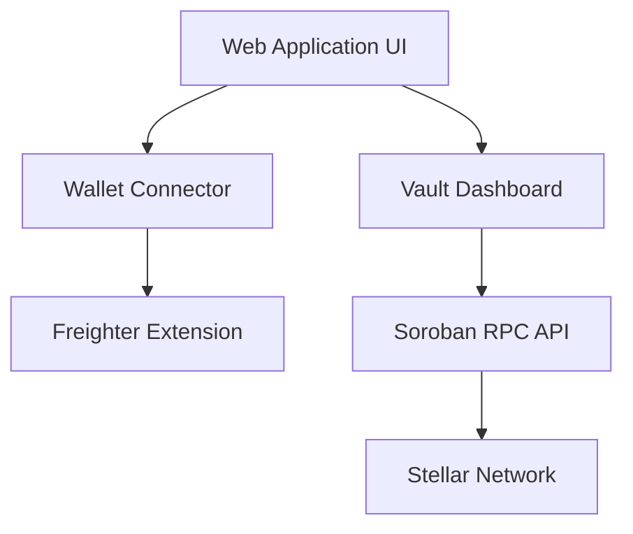

# Architecture Document: YieldVault - Stellar RWA

## 1. System Overview
YieldVault - Stellar RWA consists of a frontend Web Application and a suite of Soroban Smart Contracts deployed on the Stellar network.

## 2. Technology Stack
- **Frontend Framework:** React (via Vite)
- **Styling:** Vanilla CSS (Modern CSS properties, Glassmorphism, CSS Variables, Animations)
- **Wallet Connection:** `@stellar/freighter-api`
- **Network Interaction:** `stellar-sdk` and `soroban-client`
- **Smart Contracts (Phase 2):** Rust (compiled to WASM via Soroban)

## 3. Component Architecture

### 3.1 Frontend Architecture

### 3.2 Smart Contract Architecture (Phase 2+)
1. **Vault Contract:** 
   - State: Tracks total deposits, total shares, and current strategy allocation.
   - Core Functions: `deposit(user, amount)`, `withdraw(user, shares)`, `distribute_yield()`.
2. **Governance Module (Basic DAO):**
   - Proposal lifecycle for strategy updates.
   - Weighted voting with quorum threshold.
   - On-chain execution to set active strategy connector.
3. **Strategy Connector (BENJI):**
   - Configurable strategy address set through governance.
   - `report_benji_yield(strategy, amount)` callback for harvesting strategy yield into vault assets.
   - Provides a minimal integration boundary for expanding to other RWA issuers.

### 3.3 Custom Soroban RPC Configuration
- Frontend reads RPC settings from environment variables:
  - `VITE_SOROBAN_RPC_URL`
  - `VITE_STELLAR_NETWORK_PASSPHRASE`
  - `VITE_VAULT_CONTRACT_ID`
- Default testnet RPC is used when no custom endpoint is provided.

## 4. User Flow (Deposit)
1. User navigates to the Vault Frontend.
2. User authenticates via Freighter Wallet.
3. User enters input amount of USDC to deposit.
4. User signs Soroban transaction approving the Vault to transfer their USDC.
5. Vault contract receives USDC, calculates equivalent vault shares (based on current share price), and mints shares to the user.
6. User's Dashboard reflects new Token Balance.
